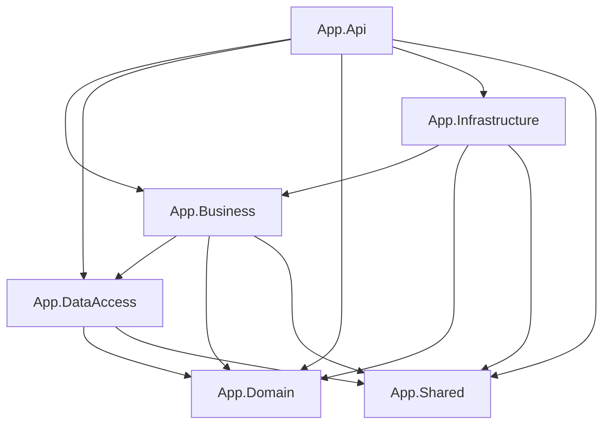

# Developer Guide

## 1. Project Overview

### What this project is
A production-ready ASP.NET Core Web API starter template with Identity, JWT authentication, refresh token rotation, email confirmation via OTP, password reset, Google login, structured logging, API versioning, and Swagger.

### Technology stack (versions)
| Technology | Version |
|---|---|
| .NET | 10.0 |
| ASP.NET Core Identity | 10.0.x |
| Entity Framework Core | 10.0.5 |
| SQL Server | Latest |
| Serilog | 4.1.0 (AspNetCore), 3.3.0 (Settings) |
| FluentValidation | 11.11.0 |
| AutoMapper | 13.0.1 |
| Swashbuckle (Swagger) | 6.6.2 |
| Asp.Versioning.Mvc | 8.1.0 |
| Google.Apis.Auth | 1.68.0 |

### Solution structure (6 projects)
- `App.Api`: Web API host, middleware, controllers, DI, Swagger, authentication configuration.
- `App.Business`: Business logic, services, validators, AutoMapper profiles, interfaces.
- `App.DataAccess`: EF Core context, repositories, unit of work, entity configurations, seeders.
- `App.Domain`: Entities, DTOs, enums.
- `App.Infrastructure`: External services (SMTP email).
- `App.Shared`: Cross-cutting constants, responses, exceptions, settings.

### Project reference diagram


## 2. Getting Started

### Prerequisites
- .NET SDK 10.0
- SQL Server (local or remote)
- Visual Studio 2026

### Steps
1. **Clone**
   ```bash
   git clone <repository-url>
   cd <repository-folder>
   ```
2. **Configure settings**
   - Update `src/App.Api/appsettings.json`:
     - `ConnectionStrings:DefaultConnection`
     - `JwtSettings` (all fields)
     - `EmailSettings`
     - `GoogleAuthSettings`
     - `SeedSettings`
     - `FrontendSettings:BaseUrl`
3. **Run migrations**
   ```bash
   dotnet ef migrations add InitialCreate --project src/App.DataAccess --startup-project src/App.Api
   dotnet ef database update --project src/App.DataAccess --startup-project src/App.Api
   ```
4. **Run the API**
   ```bash
   dotnet run --project src/App.Api
   ```

### Swagger UI
- Development only. Navigate to:
  - `https://localhost:7281/swagger`

### Default admin credentials
- Seeded from `SeedSettings` in `appsettings.json`.
- Seeding is skipped when `SeedSettings.AdminEmail` or `SeedSettings.AdminPassword` is empty.

## 3. Configuration Guide

All settings are in `src/App.Api/appsettings.json`.

### ConnectionStrings
- `DefaultConnection`: SQL Server connection string used by `ApplicationDbContext`.

### JwtSettings
- `Secret`: HMAC secret (minimum 32 characters; validated on startup).
- `Issuer`: JWT issuer.
- `Audience`: JWT audience.
- `ExpiryMinutes`: Access token lifetime in minutes.
- `RefreshTokenExpiryDays`: Refresh token lifetime in days.

### EmailSettings
- `Host`: SMTP host.
- `Port`: SMTP port (typically `587`).
- `Email`: SMTP username/email.
- `Password`: SMTP password.
- `DisplayName`: Display name for the From header.

### GoogleAuthSettings
- `ClientId`: OAuth client ID from Google Cloud Console.
- `ClientSecret`: OAuth client secret from Google Cloud Console.

**How to obtain Google credentials**
1. Create a project in Google Cloud Console.
2. Enable “Google Identity Services” or “Google OAuth” for web.
3. Create OAuth 2.0 Client ID (Web).
4. Set Authorized JavaScript origins and redirect URIs.
5. Copy `ClientId` and `ClientSecret` into `appsettings.json`.

### SeedSettings
- `AdminEmail`: Email for the seeded admin account.
- `AdminPassword`: Password for the seeded admin account.

### FrontendSettings
- `BaseUrl`: Frontend base URL used for password reset link generation.

### Serilog
- `MinimumLevel`: Default and overrides for Microsoft/System.
- `WriteTo`: Console and rolling file sink (`logs/log-{Date}.txt`).

## 4. Architecture Guide

### 3-tier architecture
- **API layer**: HTTP endpoints and middleware only.
- **Business layer**: All business logic in services.
- **DataAccess layer**: Repositories and EF Core context.

### Request lifecycle
1. HTTP request enters `App.Api`.
2. Controller delegates to `App.Business` service.
3. Service uses repositories via `IUnitOfWork`.
4. EF Core writes/reads data.
5. Service returns DTO → controller wraps in `ApiResponse<T>`.

### Soft delete
- Implemented in `ApplicationDbContext` global query filter:
  - All `BaseEntity` types are filtered by `IsDeleted = false`.
- `GenericRepository.DeleteAsync` marks `IsDeleted = true` and sets `DeletedAt`.

### Audit fields
- `ApplicationDbContext.SaveChangesAsync` sets:
  - `CreatedAt` on added entities
  - `UpdatedAt` on modified entities
  - `IsDeleted` + `DeletedAt` on deleted entities (soft delete)

### Exception flow
- Services throw `AppException` types.
- `ExceptionMiddleware` maps to `ErrorResponse`.
- In production, non-`AppException` messages are masked.

### JWT + refresh token rotation
- Access tokens created by `JwtService`.
- Refresh token stored in `RefreshTokens`.
- On refresh:
  - Validate token → revoke all existing → issue new pair.

## 5. Authentication Guide

Base URL: `https://localhost:7281`

All responses are wrapped in `ApiResponse<T>`.

### 1) Register
- **POST** `/api/v1/auth/register`
- **Body**
```json
{
  "email": "user@example.com",
  "password": "StrongP@ss1",
  "confirmPassword": "StrongP@ss1",
  "firstName": "First",
  "lastName": "Last"
}
```
- **Success**: `ApiResponse<object>` with `data: null`
- **Errors**: `409`, `400`, `500`
- **Example**
```bash
curl -X POST https://localhost:7281/api/v1/auth/register ^
  -H "Content-Type: application/json" ^
  -d "{\"email\":\"user@example.com\",\"password\":\"StrongP@ss1\",\"confirmPassword\":\"StrongP@ss1\",\"firstName\":\"First\",\"lastName\":\"Last\"}"
```

### 2) Login
- **POST** `/api/v1/auth/login`
- **Body**
```json
{
  "email": "user@example.com",
  "password": "StrongP@ss1"
}
```
- **Success**: `ApiResponse<AuthResponseDto>`
- **Errors**: `401`, `403`, `404`
- **Example**
```bash
curl -X POST https://localhost:7281/api/v1/auth/login ^
  -H "Content-Type: application/json" ^
  -d "{\"email\":\"user@example.com\",\"password\":\"StrongP@ss1\"}"
```

### 3) Refresh Token
- **POST** `/api/v1/auth/refresh-token`
- **Body**
```json
{
  "refreshToken": "<refresh-token>"
}
```
- **Success**: `ApiResponse<AuthResponseDto>`
- **Errors**: `401`, `404`
- **Example**
```bash
curl -X POST https://localhost:7281/api/v1/auth/refresh-token ^
  -H "Content-Type: application/json" ^
  -d "{\"refreshToken\":\"<refresh-token>\"}"
```

### 4) Logout
- **POST** `/api/v1/auth/logout` (Authorization required)
- **Success**: `ApiResponse<object>` with `data: null`
- **Errors**: `401`
- **Example**
```bash
curl -X POST https://localhost:7281/api/v1/auth/logout ^
  -H "Authorization: Bearer <access-token>"
```

### 5) Confirm Email
- **POST** `/api/v1/auth/confirm-email`
- **Body**
```json
{
  "userId": "<user-id>",
  "code": "123456"
}
```
- **Success**: `ApiResponse<object>` with `data: null`
- **Errors**: `400`, `404`, `500`
- **Example**
```bash
curl -X POST https://localhost:7281/api/v1/auth/confirm-email ^
  -H "Content-Type: application/json" ^
  -d "{\"userId\":\"<user-id>\",\"code\":\"123456\"}"
```

### 6) Resend Confirmation
- **POST** `/api/v1/auth/resend-confirmation`
- **Body**
```json
{
  "email": "user@example.com"
}
```
- **Success**: `ApiResponse<object>` with `data: null`
- **Errors**: `404`, `409`
- **Example**
```bash
curl -X POST https://localhost:7281/api/v1/auth/resend-confirmation ^
  -H "Content-Type: application/json" ^
  -d "{\"email\":\"user@example.com\"}"
```

### 7) Forgot Password
- **POST** `/api/v1/auth/forgot-password`
- **Body**
```json
{
  "email": "user@example.com"
}
```
- **Success**: `ApiResponse<object>` with `data: null`
- **Errors**: `200` even if user not found (no disclosure)
- **Example**
```bash
curl -X POST https://localhost:7281/api/v1/auth/forgot-password ^
  -H "Content-Type: application/json" ^
  -d "{\"email\":\"user@example.com\"}"
```

### 8) Reset Password
- **POST** `/api/v1/auth/reset-password`
- **Body**
```json
{
  "email": "user@example.com",
  "token": "<identity-token>",
  "newPassword": "StrongP@ss1",
  "confirmNewPassword": "StrongP@ss1"
}
```
- **Success**: `ApiResponse<object>` with `data: null`
- **Errors**: `400`, `404`
- **Example**
```bash
curl -X POST https://localhost:7281/api/v1/auth/reset-password ^
  -H "Content-Type: application/json" ^
  -d "{\"email\":\"user@example.com\",\"token\":\"<identity-token>\",\"newPassword\":\"StrongP@ss1\",\"confirmNewPassword\":\"StrongP@ss1\"}"
```

### 9) Google Login
- **POST** `/api/v1/auth/google-login`
- **Body**
```json
{
  "idToken": "<google-id-token>"
}
```
- **Success**: `ApiResponse<AuthResponseDto>`
- **Errors**: `401`, `403`, `400`, `500`
- **Example**
```bash
curl -X POST https://localhost:7281/api/v1/auth/google-login ^
  -H "Content-Type: application/json" ^
  -d "{\"idToken\":\"<google-id-token>\"}"
```

### 10) Change Password
- **POST** `/api/v1/auth/change-password` (Authorization required)
- **Body**
```json
{
  "currentPassword": "OldP@ss1",
  "newPassword": "StrongP@ss2",
  "confirmNewPassword": "StrongP@ss2"
}
```
- **Success**: `ApiResponse<object>` with `data: null`
- **Errors**: `400`, `401`, `404`
- **Example**
```bash
curl -X POST https://localhost:7281/api/v1/auth/change-password ^
  -H "Authorization: Bearer <access-token>" ^
  -H "Content-Type: application/json" ^
  -d "{\"currentPassword\":\"OldP@ss1\",\"newPassword\":\"StrongP@ss2\",\"confirmNewPassword\":\"StrongP@ss2\"}"
```

## 6. Authorization Guide

### Roles
Defined in `App.Domain.Enums.Roles`:
- `Admin`
- `User`

Seeded in `App.DataAccess.Seeders.RoleSeeder`.

### Policies
Defined in `App.Shared.Constants.PolicyConstants`:
- `RequireAdmin`
- `RequireUser`

Configured in `AddIdentityConfiguration`.

### Protect an endpoint
```csharp src/App.Api/Controllers/SomeController.cs
[Authorize]
[HttpGet("secure")]
public ActionResult<ApiResponse<string>> Secure()
{
    return Ok(ApiResponse<string>.Ok("ok"));
}
```

### Protect with policy
```csharp src/App.Api/Controllers/AdminController.cs
[Authorize(Policy = PolicyConstants.RequireAdmin)]
[HttpGet("admin")]
public ActionResult<ApiResponse<string>> Admin()
{
    return Ok(ApiResponse<string>.Ok("admin"));
}
```

### Get current user id inside a controller
```csharp src/App.Api/Controllers/AuthController.cs
var userId = User.FindFirstValue(JwtRegisteredClaimNames.Sub);
```

## 7. API Response Format

### `ApiResponse<T>`
```json
{
  "success": true,
  "message": "Success",
  "data": {
    "accessToken": "<token>",
    "refreshToken": "<token>",
    "expiresAt": "2026-05-03T12:00:00Z",
    "email": "user@example.com",
    "roles": ["User"]
  }
}
```

### `ErrorResponse`
```json
{
  "success": false,
  "message": "Invalid credentials.",
  "statusCode": 401,
  "errors": null
}
```

### Status codes
- `200`: Successful request.
- `400`: Validation failures.
- `401`: Authentication failures.
- `403`: Forbidden or email not confirmed.
- `404`: Resource not found.
- `409`: Conflict (e.g., user already exists).
- `500`: Server errors.

## 8. Adding a New Entity (Step by Step)

Example entity: `Product`.

### Step 1 — Domain
**Files**
- `src/App.Domain/Entities/Product.cs`
- `src/App.Domain/DTOs/ProductCreateDto.cs`
- `src/App.Domain/DTOs/ProductUpdateDto.cs`
- `src/App.Domain/DTOs/ProductResponseDto.cs`

```csharp src/App.Domain/Entities/Product.cs
namespace App.Domain.Entities;

public class Product : BaseEntity
{
    public string Name { get; set; } = string.Empty;
    public string Description { get; set; } = string.Empty;
    public decimal Price { get; set; }
}
```

```csharp src/App.Domain/DTOs/ProductCreateDto.cs
namespace App.Domain.DTOs;

public class ProductCreateDto
{
    public string Name { get; set; } = string.Empty;
    public string Description { get; set; } = string.Empty;
    public decimal Price { get; set; }
}
```

```csharp src/App.Domain/DTOs/ProductUpdateDto.cs
namespace App.Domain.DTOs;

public class ProductUpdateDto
{
    public string Name { get; set; } = string.Empty;
    public string Description { get; set; } = string.Empty;
    public decimal Price { get; set; }
}
```

```csharp src/App.Domain/DTOs/ProductResponseDto.cs
namespace App.Domain.DTOs;

public class ProductResponseDto
{
    public Guid Id { get; set; }
    public string Name { get; set; } = string.Empty;
    public string Description { get; set; } = string.Empty;
    public decimal Price { get; set; }
}
```

**Rules**
- Entities inherit `BaseEntity`.
- DTOs have no logic.

### Step 2 — DataAccess
**Files**
- `src/App.DataAccess/Configurations/ProductConfiguration.cs`
- `src/App.DataAccess/Repositories/IProductRepository.cs`
- `src/App.DataAccess/Repositories/ProductRepository.cs`
- `src/App.DataAccess/Context/ApplicationDbContext.cs`
- `src/App.DataAccess/UnitOfWork/IUnitOfWork.cs`
- `src/App.DataAccess/UnitOfWork/UnitOfWork.cs`
- `src/App.DataAccess/Extensions/ServiceCollectionExtensions.cs`

```csharp src/App.DataAccess/Configurations/ProductConfiguration.cs
using App.Domain.Entities;
using Microsoft.EntityFrameworkCore;
using Microsoft.EntityFrameworkCore.Metadata.Builders;

namespace App.DataAccess.Configurations;

public class ProductConfiguration : IEntityTypeConfiguration<Product>
{
    private const int NameMaxLength = 200;

    public void Configure(EntityTypeBuilder<Product> builder)
    {
        builder.HasKey(product => product.Id);

        builder.Property(product => product.Name)
            .IsRequired()
            .HasMaxLength(NameMaxLength);

        builder.Property(product => product.Description)
            .HasMaxLength(1000);

        builder.Property(product => product.Price)
            .IsRequired();
    }
}
```

```csharp src/App.DataAccess/Repositories/IProductRepository.cs
using App.Domain.Entities;

namespace App.DataAccess.Repositories;

public interface IProductRepository : IGenericRepository<Product>
{
}
```

```csharp src/App.DataAccess/Repositories/ProductRepository.cs
using App.Domain.Entities;

namespace App.DataAccess.Repositories;

public class ProductRepository : GenericRepository<Product>, IProductRepository
{
    public ProductRepository(Context.ApplicationDbContext context) : base(context)
    {
    }
}
```

```csharp src/App.DataAccess/Context/ApplicationDbContext.cs
public DbSet<Product> Products => Set<Product>();
```

```csharp src/App.DataAccess/UnitOfWork/IUnitOfWork.cs
IProductRepository Products { get; }
```

```csharp src/App.DataAccess/UnitOfWork/UnitOfWork.cs
private IProductRepository? _productRepository;
public IProductRepository Products => _productRepository ??= new ProductRepository(_context);
```

```csharp src/App.DataAccess/Extensions/ServiceCollectionExtensions.cs
services.AddScoped<IProductRepository, ProductRepository>();
```

**Migration**
```bash
dotnet ef migrations add AddProduct --project src/App.DataAccess --startup-project src/App.Api
dotnet ef database update --project src/App.DataAccess --startup-project src/App.Api
```

### Step 3 — Business
**Files**
- `src/App.Business/Interfaces/IProductService.cs`
- `src/App.Business/Services/ProductService.cs`
- `src/App.Business/Validators/ProductCreateDtoValidator.cs`
- `src/App.Business/Validators/ProductUpdateDtoValidator.cs`
- `src/App.Business/Mappings/ProductProfile.cs`

```csharp src/App.Business/Interfaces/IProductService.cs
using App.Domain.DTOs;

namespace App.Business.Interfaces;

public interface IProductService
{
    Task<IEnumerable<ProductResponseDto>> GetAllAsync(int page, int pageSize);
    Task<ProductResponseDto> GetByIdAsync(Guid id);
    Task<ProductResponseDto> CreateAsync(ProductCreateDto dto);
    Task<ProductResponseDto> UpdateAsync(Guid id, ProductUpdateDto dto);
    Task DeleteAsync(Guid id);
}
```

```csharp src/App.Business/Services/ProductService.cs
using App.Business.Interfaces;
using App.DataAccess.UnitOfWork;
using App.Domain.DTOs;
using App.Domain.Entities;
using App.Shared.Exceptions;
using AutoMapper;

namespace App.Business.Services;

public class ProductService : IProductService
{
    private readonly IUnitOfWork _unitOfWork;
    private readonly IMapper _mapper;

    public ProductService(IUnitOfWork unitOfWork, IMapper mapper)
    {
        _unitOfWork = unitOfWork;
        _mapper = mapper;
    }

    public async Task<IEnumerable<ProductResponseDto>> GetAllAsync(int page, int pageSize)
    {
        var items = await _unitOfWork.Products.GetAllAsync(null, page, pageSize);
        return _mapper.Map<IEnumerable<ProductResponseDto>>(items);
    }

    public async Task<ProductResponseDto> GetByIdAsync(Guid id)
    {
        var entity = await _unitOfWork.Products.GetByIdAsync(id);
        if (entity is null)
        {
            throw new NotFoundException("Product not found.");
        }

        return _mapper.Map<ProductResponseDto>(entity);
    }

    public async Task<ProductResponseDto> CreateAsync(ProductCreateDto dto)
    {
        var entity = _mapper.Map<Product>(dto);
        entity.Id = Guid.NewGuid();

        await _unitOfWork.Products.AddAsync(entity);
        await _unitOfWork.SaveChangesAsync();

        return _mapper.Map<ProductResponseDto>(entity);
    }

    public async Task<ProductResponseDto> UpdateAsync(Guid id, ProductUpdateDto dto)
    {
        var entity = await _unitOfWork.Products.GetByIdAsync(id);
        if (entity is null)
        {
            throw new NotFoundException("Product not found.");
        }

        _mapper.Map(dto, entity);
        await _unitOfWork.Products.UpdateAsync(entity);
        await _unitOfWork.SaveChangesAsync();

        return _mapper.Map<ProductResponseDto>(entity);
    }

    public async Task DeleteAsync(Guid id)
    {
        var entity = await _unitOfWork.Products.GetByIdAsync(id);
        if (entity is null)
        {
            throw new NotFoundException("Product not found.");
        }

        await _unitOfWork.Products.DeleteAsync(entity);
        await _unitOfWork.SaveChangesAsync();
    }
}
```

```csharp src/App.Business/Validators/ProductCreateDtoValidator.cs
using App.Domain.DTOs;
using FluentValidation;

namespace App.Business.Validators;

public class ProductCreateDtoValidator : AbstractValidator<ProductCreateDto>
{
    public ProductCreateDtoValidator()
    {
        RuleFor(dto => dto.Name).NotEmpty().MaximumLength(200);
        RuleFor(dto => dto.Description).MaximumLength(1000);
        RuleFor(dto => dto.Price).GreaterThan(0);
    }
}
```

```csharp src/App.Business/Validators/ProductUpdateDtoValidator.cs
using App.Domain.DTOs;
using FluentValidation;

namespace App.Business.Validators;

public class ProductUpdateDtoValidator : AbstractValidator<ProductUpdateDto>
{
    public ProductUpdateDtoValidator()
    {
        RuleFor(dto => dto.Name).NotEmpty().MaximumLength(200);
        RuleFor(dto => dto.Description).MaximumLength(1000);
        RuleFor(dto => dto.Price).GreaterThan(0);
    }
}
```

```csharp src/App.Business/Mappings/ProductProfile.cs
using App.Domain.DTOs;
using App.Domain.Entities;
using AutoMapper;

namespace App.Business.Mappings;

public class ProductProfile : Profile
{
    public ProductProfile()
    {
        CreateMap<ProductCreateDto, Product>();
        CreateMap<ProductUpdateDto, Product>();
        CreateMap<Product, ProductResponseDto>();
    }
}
```

### Step 4 — API
**Files**
- `src/App.Api/Controllers/ProductsController.cs`
- `src/App.Business/Extensions/ServiceCollectionExtensions.cs`

```csharp src/App.Api/Controllers/ProductsController.cs
using App.Business.Interfaces;
using App.Domain.DTOs;
using App.Shared.Responses;
using Asp.Versioning;
using Microsoft.AspNetCore.Authorization;
using Microsoft.AspNetCore.Mvc;

namespace App.Api.Controllers;

[ApiController]
[ApiVersion("1.0")]
[Route("api/v{version:apiVersion}/[controller]")]
public class ProductsController : ControllerBase
{
    private readonly IProductService _service;

    public ProductsController(IProductService service)
    {
        _service = service;
    }

    [HttpGet]
    public async Task<ActionResult<ApiResponse<IEnumerable<ProductResponseDto>>>> GetAll([FromQuery] int page = 1, [FromQuery] int pageSize = 10)
    {
        var items = await _service.GetAllAsync(page, pageSize);
        return Ok(ApiResponse<IEnumerable<ProductResponseDto>>.Ok(items));
    }

    [HttpGet("{id:guid}")]
    public async Task<ActionResult<ApiResponse<ProductResponseDto>>> GetById(Guid id)
    {
        var item = await _service.GetByIdAsync(id);
        return Ok(ApiResponse<ProductResponseDto>.Ok(item));
    }

    [Authorize]
    [HttpPost]
    public async Task<ActionResult<ApiResponse<ProductResponseDto>>> Create([FromBody] ProductCreateDto dto)
    {
        var item = await _service.CreateAsync(dto);
        return Ok(ApiResponse<ProductResponseDto>.Ok(item));
    }

    [Authorize]
    [HttpPut("{id:guid}")]
    public async Task<ActionResult<ApiResponse<ProductResponseDto>>> Update(Guid id, [FromBody] ProductUpdateDto dto)
    {
        var item = await _service.UpdateAsync(id, dto);
        return Ok(ApiResponse<ProductResponseDto>.Ok(item));
    }

    [Authorize]
    [HttpDelete("{id:guid}")]
    public async Task<ActionResult<ApiResponse<object>>> Delete(Guid id)
    {
        await _service.DeleteAsync(id);
        return Ok(ApiResponse<object>.Ok(null));
    }
}
```

```csharp src/App.Business/Extensions/ServiceCollectionExtensions.cs
services.AddScoped<IProductService, ProductService>();
```

### Step 5 — Test in Swagger
- Run API and use `/swagger`.
- Create, update, list, and delete `Product` resources.
- Ensure deleted products are hidden due to soft delete.

## 9. Project Conventions

### Naming conventions
| Element | Convention | Example |
|---|---|---|
| Classes | PascalCase | `AuthService` |
| Interfaces | `I` + PascalCase | `IAuthService` |
| Methods | PascalCase | `GetByIdAsync` |
| Properties | PascalCase | `CreatedAt` |
| Private fields | `_` + camelCase | `_unitOfWork` |
| DTOs | PascalCase + `Dto` | `RegisterDto` |
| Controllers | PascalCase + `Controller` | `AuthController` |
| Validators | PascalCase + `Validator` | `RegisterDtoValidator` |

### Rules
- Controllers are thin; no business logic.
- Services return DTOs only.
- No hard deletes; use soft delete.
- No `new` keyword for services (DI only).

### Exception usage
- `ValidationException`: invalid input.
- `UnauthorizedException`: invalid/expired tokens.
- `ForbiddenException`: access denied or email not confirmed.
- `NotFoundException`: entity not found.
- `ConflictException`: duplicates or conflicting state.
- `ServerException`: internal failures.

### Add a new policy
1. Add constant in `App.Shared.Constants.PolicyConstants`.
2. Register policy in `AddIdentityConfiguration`.
3. Use `[Authorize(Policy = PolicyConstants.YourPolicy)]`.

### Add a new role
1. Add to `App.Domain.Enums.Roles`.
2. Seeded automatically by `RoleSeeder`.

## 10. Folder Structure Reference

```
.
├── .github
│   └── copilot-instructions.md          - Project rules and blueprint
├── App.sln                               - Solution file
└── src
    ├── App.Api
    │   ├── Controllers
    │   │   └── AuthController.cs         - Auth endpoints
    │   ├── Extensions
    │   │   ├── ConfigureSwaggerOptions.cs- Swagger versioning + security
    │   │   └── ServiceCollectionExtensions.cs - Identity/JWT/Swagger config
    │   ├── Middlewares
    │   │   └── ExceptionMiddleware.cs    - Global exception handling
    │   ├── Properties
    │   │   └── launchSettings.json       - Dev URLs
    │   ├── appsettings.json              - Configuration
    │   └── Program.cs                    - App bootstrap
    ├── App.Business
    │   ├── Extensions
    │   │   └── ServiceCollectionExtensions.cs - Business DI registration
    │   ├── Interfaces
    │   │   ├── IAuthService.cs           - Auth service contract
    │   │   ├── IEmailService.cs          - Email service contract
    │   │   └── IJwtService.cs            - JWT service contract
    │   ├── Mappings
    │   │   └── AuthProfile.cs            - AutoMapper profile
    │   ├── Models
    │   │   └── AccessTokenResult.cs      - JWT result model
    │   ├── Services
    │   │   ├── AuthService.cs            - Authentication logic
    │   │   └── JwtService.cs             - JWT creation
    │   └── Validators
    │       ├── ChangePasswordDtoValidator.cs
    │       ├── ConfirmEmailDtoValidator.cs
    │       ├── ForgotPasswordDtoValidator.cs
    │       ├── LoginDtoValidator.cs
    │       ├── RegisterDtoValidator.cs
    │       └── ResetPasswordDtoValidator.cs
    ├── App.DataAccess
    │   ├── Configurations
    │   │   ├── ApplicationUserConfiguration.cs
    │   │   ├── EmailOtpConfiguration.cs
    │   │   └── RefreshTokenConfiguration.cs
    │   ├── Context
    │   │   └── ApplicationDbContext.cs   - EF Core context
    │   ├── Extensions
    │   │   └── ServiceCollectionExtensions.cs - DataAccess DI
    │   ├── Repositories
    │   │   ├── AuthRepository.cs
    │   │   ├── GenericRepository.cs
    │   │   ├── IAuthRepository.cs
    │   │   ├── IGenericRepository.cs
    │   │   ├── IUserRepository.cs
    │   │   └── UserRepository.cs
    │   ├── Seeders
    │   │   ├── AdminSeeder.cs
    │   │   └── RoleSeeder.cs
    │   └── UnitOfWork
    │       ├── IUnitOfWork.cs
    │       └── UnitOfWork.cs
    ├── App.Domain
    │   ├── DTOs
    │   │   ├── AuthResponseDto.cs
    │   │   ├── ChangePasswordDto.cs
    │   │   ├── ConfirmEmailDto.cs
    │   │   ├── ForgotPasswordDto.cs
    │   │   ├── GoogleLoginDto.cs
    │   │   ├── LoginDto.cs
    │   │   ├── RefreshTokenDto.cs
    │   │   ├── RegisterDto.cs
    │   │   ├── ResendConfirmationDto.cs
    │   │   └── ResetPasswordDto.cs
    │   ├── Entities
    │   │   ├── ApplicationUser.cs
    │   │   ├── BaseEntity.cs
    │   │   ├── EmailOtp.cs
    │   │   └── RefreshToken.cs
    │   └── Enums
    │       └── Roles.cs
    ├── App.Infrastructure
    │   ├── Email
    │   │   └── EmailService.cs
    │   └── Extensions
    │       └── ServiceCollectionExtensions.cs
    └── App.Shared
        ├── Constants
        │   ├── AuthConstants.cs
        │   ├── AuthErrorMessages.cs
        │   ├── ErrorMessages.cs
        │   ├── IdentityConstants.cs
        │   ├── PolicyConstants.cs
        │   └── ValidationConstants.cs
        ├── Exceptions
        │   ├── AppException.cs
        │   ├── ConflictException.cs
        │   ├── ForbiddenException.cs
        │   ├── NotFoundException.cs
        │   ├── ServerException.cs
        │   ├── UnauthorizedException.cs
        │   └── ValidationException.cs
        ├── Responses
        │   ├── ApiResponse.cs
        │   └── ErrorResponse.cs
        └── Settings
            ├── EmailSettings.cs
            ├── FrontendSettings.cs
            ├── GoogleAuthSettings.cs
            ├── JwtSettings.cs
            └── SeedSettings.cs
```

## 11. Common Mistakes to Avoid

1. **Forgetting `SaveChangesAsync`**: Always call `_unitOfWork.SaveChangesAsync()` after repository operations.
2. **Adding logic to controllers**: Keep logic in services.
3. **Returning entities directly**: Use DTOs and `ApiResponse<T>`.
4. **Using hard deletes**: Use `DeleteAsync` or set `IsDeleted`.
5. **Injecting `ApplicationDbContext` into services**: Use repositories and `IUnitOfWork`.
6. **Not revoking refresh tokens on password change**: Use `_unitOfWork.Auth.RevokeAllUserTokensAsync`.
7. **Logging sensitive data**: Never log passwords or tokens.
8. **Missing email confirmation before login**: `SignInManager` requires `EmailConfirmed`.
9. **Skipping validation**: Validators are required and auto-registered.
10. **JWT secret too short**: `JwtSettings.Secret` must be 32+ characters.
11. **Not binding settings via `IOptions<T>`**: Do not inject `IConfiguration` into services.
12. **Breaking middleware order**: Keep the required pipeline order.

## 12. Troubleshooting

### Migration errors
- Ensure SQL Server is running and `DefaultConnection` is correct.
- Run:
  ```bash
  dotnet ef database update --project src/App.DataAccess --startup-project src/App.Api
  ```

### JWT validation failures
- Verify `JwtSettings.Secret` length (>= 32).
- Ensure `Issuer` and `Audience` match token claims.
- Confirm system clock is correct (no clock skew).

### Email not sending
- Check SMTP settings in `EmailSettings`.
- Confirm SMTP allows SSL on the configured port.
- Inspect logs for `EmailService` errors.

### Google login failing
- Verify `GoogleAuthSettings.ClientId`.
- Ensure the ID token is for the same client ID.
- Confirm Google OAuth credentials are configured for web.

### Swagger not showing endpoints
- `app.UseSwagger()` runs only in Development.
- Check `ASPNETCORE_ENVIRONMENT` is `Development`.

### 401 vs 403 confusion
- `401`: Missing/invalid token.
- `403`: Token valid but access denied or email not confirmed.